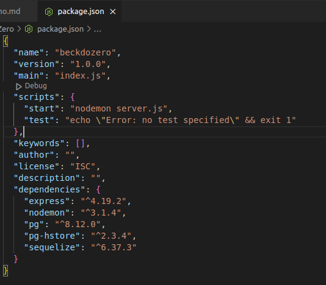
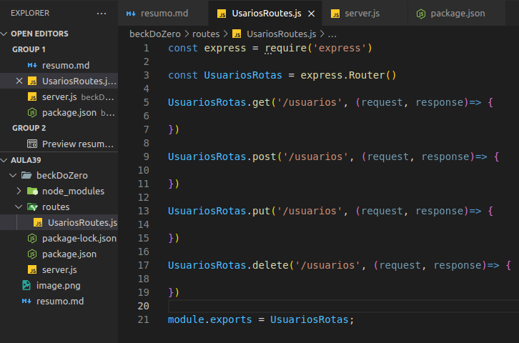
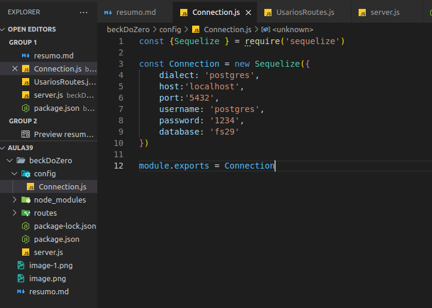

# backend padrao rest ful Api

configura

``` bash
npm init -y 
```

as bibliotecas que vamos usa 

``` bash
npm i express nodemon sequelize pg pg-hstore

```

depois tem que ir la no package.json e configura o script



# Documentação do Código de Servidor Node.js com Express

Este documento descreve o funcionamento de um código simples de servidor web usando o framework Express em Node.js.

## Pré-requisitos

- Node.js instalado
- Módulo `express` instalado (`npm install express`)

## Estrutura do Código

```javascript
const express = require('express')
const app = express()

app.get('/', (request, response)=> {
    return response.status(200).send('Hellow BackEnd')
})

app.listen(3000, 'localhost', ()=>{
    console.log("Servidor executando em http://localhost:3000")
})


```

essa parte aqui e da rota padrao para deixa o codigo mais organizados vamos retira essa parte daqui e vamos coloca em um arq que vamos criar chamado route

```javascript
app.get('/', (request, response)=> {
    return response.status(200).send('Hellow BackEnd')
})
```

onde vai fica dessa forma criar uma pasta routes e dentro desta pasta faço o UsuariosRoutes.js



assim nossa rotas vai fica bem mais organizadas

agora vamos organizar a nossa conecticao com nosso banco de dados que nesse caso vai ser o postgres
vamos criar uma pasta config onde vamos criar um arq js com nome Connection.js



